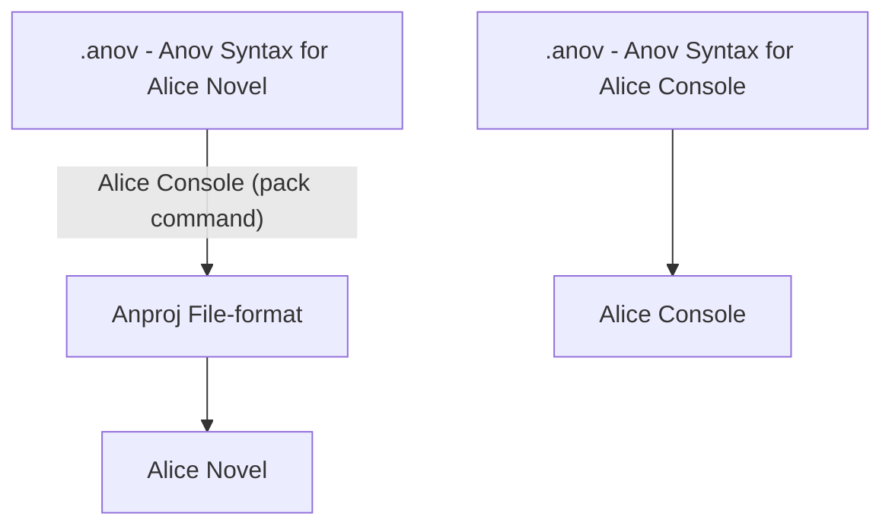
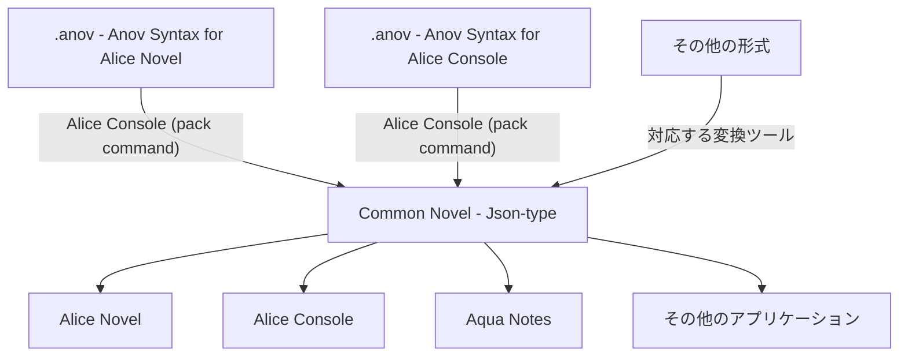

## Alice Novel v0.9.5 の予定と、新しい構文

### はじめに

[先日の記事](../20250527)の通り、ついに Alice Novel v0.9.3 が Microsoft Store にて、公開されました!!

v0.9.4 についてもかなり開発が進んでおり、近日リリース予定です!

本記事では、更に次のバージョンである、v0.9.5 のリリース予定について記載していきます。

## 開発予定

### Alice Novel v0.9.5 の主な予定

Alice Novel では主に、以下のことを予定しています。

- 大規模リファクタリング (機能の分離により、開発効率の向上)
- 読み込むファイルを Anproj + Anov 形式から、後述する Common Novel Json 方式に変更
- テストコードの追加 (リファクタリング語に作成)

### おまけ: Alice Console next の予定

本題から少し逸れますが、Alice Console の次期バージョン (おそらく v0.4.0) の開発予定は以下のとおりです。(詳細は未定)

- 読み込むファイルを Anov 構文から、後述する Common Novel Json 方式に変更
- `test` コマンドの実装 (1節に同じ命令が2つ被っている場合に警告)
- `format` コマンドの実装 (命令が1つもない節 (2つ以上続いている改行) を削除、不要なスペースの削除)

このように書いていますが、Alice Console についての開発計画はまだ未定な部分が多いです。(今まで Alice Console のリポジトリ内で管理していた Anov Syntax は、Anov to Common Novel Json コンバーターのような役割に変更されます)

### おまけ: Aqua Notes の予定

Aqua Notes に関しての開発予定は特にありません。

Alice Novel 開発当時の計画していた、GUI ワークフローからゲーム開発できるツールを開発してもよいですが、かなり時間が掛かりそうなので、現実的には検討していません。

## Json 形式を利用した Common Novel の導入検討

### 今までの方式

今までは、Anov Syntax という構文が利用され、これらは、構文自体はおおよそ統一しています。

ただ、仕様に関してはそれぞれ微妙異なることから、Anov Syntax for Alice Novel と Anov Syntax for Alice Console として定義していました。(イメージとしては [MFM](https://misskey-hub.net/docs/for-users/features/mfm/)、[GFM](https://github.github.com/gfm/)、[GLFM](https://docs.gitlab.com/user/markdown/) のようなフレーバー扱い)

また、この統一したルールを文章として厳格な規定を設けるというのが、当時の commonnovel-spec の方針でした。(ここでは、"旧 Common Novel" とする)

### 旧 Common Novel の問題点

ここまで話してきた Anov Syntax / 旧 Common Novel についてですが、いくつかの問題点がありました。

#### 構文の数に限りがある

現在は、会話文を `[` `]`、場所 (背景画像) を `> `、キャラクター (前面画像) を `- ` などと定義してきました。

しかし、画像表示の詳細な指定 (場所やサイズの変更) ができない、アニメーションができない、などの問題がありました。(アニメーションについては、`{` `}` で指定する、`: ` で指定するなどのアイデアはあるが)

また、構文は改行で区切っている (改行と改行の間を節と定義し、その1節を動かす) という特殊な方式を活用していることから、読み込みの難しさ、正確なスペックの定義などが難しいと考えていました。

そこで、Json を利用することで、詳細な設定などができるのではないかと考えるようになります。

ただ、Json 形式は人間でも読み書きできるものの、Json で記載すると非常に長くなるため、これを人間で作成したり、デバッグのために読むというのは無理があります。

そこで、Anov 構文を Json 形式に変換して読み込ませる方式を導入することにしました。(なお、コンバーターさえあれば、Anov 構文以外でも、Json 形式に変換して利用できます) (結局、構文の数に限りがある問題は解決していない模様)

#### 分岐

Anov Syntax では、構文の分岐読み取りがやや難儀でした。(読み込みの際に、戻る必要がある)

#### 読み込み速度

Anov Syntax は、リアルタイム読み込みなので、事前読み込み時間がないというメリットがあります。(一応、Alice Novel の開発当時の最大のメリットはこれだった) しかし、動画読み込みが遅い、分岐 (if 文) の開発が難しい、などのデメリットも存在していました。

ほとんどのプログラミング言語では Json 形式の読み込みライブラリが発達しており、自作した Anov リーダーよりも圧倒的な速度を実現できると考えています。(というか、そもそも正規表現使う時点で速度が遅くなっていると思う)

#### プラグイン

プラグイン開発は、セキュリティー的な問題で長らく考えられていません。しかし、そもそも前述の構文の数の限りがあるため、構文的な対応も難しいと考えています。

Json 形式にすることで、

```json
"plugin": [
  {
    "name": "plugin-1",
    "image": "ur.png"
  },
  {
    "name": "plugin-2",
    "input": "sol.mp3"
  }
]
```

のような、柔軟に画像挿入や文字列の挿入、稼働が可能になると考えています。

### 注意点

- Common Novel Json は、Anov 構文を代替するものではない

### 目的

<!-- TBW -->

### 導入予定

1. Anov Syntax (Alice Console リポジトリ) にて Anov to Common Novel Json の変換ツールを開発
1. Alice Console に導入
1. Alice Novel に導入
1. (Aqua Notes に導入)

### 変更

#### Anov Syntax



#### Common Novel Json



(Alice Console の場合は、基本 Hot Reload (JIT コンパイル相当) をするので、体感として Common Novel に変換している感じはないが、内部的には変換されている)

### 備考

<!-- TBW -->
